# 🚀 Stage 2: Google Cloud Run Deployment Pipeline

This document provides a comprehensive guide for the Stage 2 Google Cloud Run deployment pipeline that automatically deploys validated Docker images to production.

## 📋 Overview

The Stage 2 pipeline is designed to:
- **Trigger automatically** after successful Stage 1 completion
- **Deploy to Google Cloud Run** in the `api-outreach-as-a-service` project
- **Support multiple environments** (production, staging, development)
- **Include comprehensive verification** and rollback capabilities
- **Provide detailed notifications** and monitoring

## 🎯 Key Features

### ✅ **Automatic Triggering**
- Runs after successful Stage 1 completion
- Manual trigger support with environment selection
- Force deployment option for emergency situations

### 🔐 **Secure Authentication**
- Workload Identity Federation (recommended)
- No long-lived service account keys
- Fine-grained permissions and access control

### 🌍 **Multi-Environment Support**
- **Production** (main branch): Full security, high resources
- **Staging** (develop branch): Testing environment
- **Development** (other branches): Development environment

### 🔄 **Comprehensive Verification**
- Health checks and API endpoint testing
- Performance monitoring
- Automatic rollback on failure

### 📊 **Monitoring & Notifications**
- Slack notifications for deployment status
- Detailed deployment summaries
- Performance metrics and health monitoring

## 🏗️ Architecture

```mermaid
graph TD
    A[Stage 1 Success] --> B[Pre-deployment Validation]
    B --> C[Google Cloud Authentication]
    C --> D[Image Transfer: GHCR → GCR]
    D --> E[Deploy to Cloud Run]
    E --> F[Post-deployment Verification]
    F --> G{Deployment Success?}
    G -->|Yes| H[Send Success Notification]
    G -->|No| I[Automatic Rollback]
    I --> J[Send Failure Notification]
    H --> K[Deployment Complete]
    J --> K
```



## 🚀 Quick Start

### 1. **Set Up Google Cloud Project**

```bash
# Run the setup script
./scripts/setup-gcp.sh
```

### 2. **Configure GitHub Secrets**

Use the GitHub Actions workflow to set up secrets:

1. Go to **Actions** → **Setup GitHub Secrets for Stage 2 Deployment**
2. Click **Run workflow**
3. Fill in the required parameters
4. Click **Run workflow**

### 3. **Test the Pipeline**

```bash
# Push to main branch to trigger production deployment
git push origin main

# Or manually trigger deployment
# Go to Actions → Stage 2 - Google Cloud Run Deployment Pipeline
# Click "Run workflow" and select environment
```

## 🔧 Configuration

### Environment-Specific Settings

| Environment | Branch | Authentication | Resources | Scaling |
|-------------|--------|----------------|-----------|---------|
| **Production** | `main` | `--no-allow-unauthenticated` | 2 CPU, 2Gi | 1-100 instances |
| **Staging** | `develop` | `--allow-unauthenticated` | 1 CPU, 1Gi | 0-10 instances |
| **Development** | Others | `--allow-unauthenticated` | 1 CPU, 512Mi | 0-5 instances |

### Required Secrets

| Secret | Description | Example |
|--------|-------------|---------|
| `WIF_PROVIDER` | Workload Identity Federation provider | `projects/123/locations/global/workloadIdentityPools/...` |
| `WIF_SERVICE_ACCOUNT` | Service account email | `github-actions@api-outreach-as-a-service.iam.gserviceaccount.com` |
| `REDIS_URL` | Redis connection string | `redis://your-redis:6379` |
| `JWT_SECRET` | JWT signing secret | `your-secret-key` |
| `GROWCHIEF_ENDPOINT` | GrowChief API endpoint | `https://api.growchief.com` |
| `GROWCHIEF_API_KEY` | GrowChief API key | `your-api-key` |
| `GOOGLE_CLIENT_ID` | Google OAuth client ID | `your-client-id` |
| `GOOGLE_CLIENT_SECRET` | Google OAuth client secret | `your-client-secret` |
| `SLACK_WEBHOOK_URL` | Slack webhook (optional) | `https://hooks.slack.com/services/...` |

## 🔄 Deployment Process

### 1. **Pre-deployment Validation**
- Checks Stage 1 completion status
- Determines target environment
- Validates deployment conditions

### 2. **Authentication**
- Authenticates with Google Cloud using Workload Identity Federation
- Configures Docker for Google Container Registry access
- Verifies permissions and access

### 3. **Image Transfer**
- Pulls Docker image from GitHub Container Registry (GHCR)
- Tags image for Google Container Registry (GCR)
- Pushes image to GCR

### 4. **Deployment**
- Deploys to Google Cloud Run with environment-specific configuration
- Sets environment variables and secrets
- Configures resource allocation and scaling

### 5. **Verification**
- Waits for service to be ready
- Runs health checks on `/health` endpoint
- Tests API endpoints accessibility
- Performs performance checks

### 6. **Rollback (if needed)**
- Automatically rolls back to previous revision on failure
- Maintains service availability
- Logs rollback actions

### 7. **Notifications**
- Sends Slack notifications with deployment status
- Creates detailed deployment summaries
- Provides links to monitoring and logs

## 📊 Monitoring & Observability

### Health Checks
- **Endpoint**: `GET /health`
- **Frequency**: Every 30 seconds
- **Timeout**: 3 seconds
- **Retries**: 3 attempts

### Performance Monitoring
- Response time tracking
- API endpoint accessibility
- Resource utilization monitoring

### Logging
- Structured logging with environment context
- Request/response logging
- Error tracking and alerting

## 🚨 Rollback Strategy

### Automatic Rollback
- Triggered on deployment failure
- Rolls back to previous successful revision
- Maintains 100% traffic to previous version

### Manual Rollback
```bash
# List revisions
gcloud run revisions list --service api-outreach-service --region us-east1

# Rollback to specific revision
gcloud run services update-traffic api-outreach-service \
  --to-revisions REVISION_NAME=100 \
  --region us-east1
```

## 🔧 Troubleshooting

### Common Issues

#### 1. **Authentication Failures**
```bash
# Check Workload Identity Federation setup
gcloud iam workload-identity-pools describe github-actions-pool --location=global

# Verify service account permissions
gcloud projects get-iam-policy api-outreach-as-a-service
```

#### 2. **Deployment Failures**
```bash
# Check service status
gcloud run services describe api-outreach-service --region us-east1

# View deployment logs
gcloud logs read "resource.type=cloud_run_revision" --limit 50
```

#### 3. **Health Check Failures**
```bash
# Test health endpoint
curl -f https://your-service-url/health

# Check application logs
gcloud logs read "resource.type=cloud_run_revision AND resource.labels.service_name=api-outreach-service" --limit 50
```

### Debug Commands

```bash
# Check service status
gcloud run services describe api-outreach-service --region us-east1

# View logs
gcloud logs read "resource.type=cloud_run_revision AND resource.labels.service_name=api-outreach-service" --limit 50

# Test health endpoint
curl -f https://your-service-url/health

# Check IAM permissions
gcloud projects get-iam-policy api-outreach-as-a-service
```

## 📈 Performance Optimization

### Resource Tuning
- Monitor CPU and memory usage in Cloud Console
- Adjust instance limits based on traffic patterns
- Optimize concurrency settings for your workload

### Cost Optimization
- Use appropriate instance sizes for each environment
- Set minimum instances to 0 for non-production environments
- Monitor and optimize resource allocation regularly

## 🔒 Security Best Practices

1. **Use Workload Identity Federation** instead of service account keys
2. **Enable audit logging** for all operations
3. **Implement proper IAM roles** with least privilege principle
4. **Use HTTPS only** for all communications
5. **Regular security updates** for base images
6. **Monitor for security vulnerabilities** with Container Analysis

## 📝 Environment Variables

The following environment variables are automatically set during deployment:

| Variable | Description | Example |
|----------|-------------|---------|
| `NODE_ENV` | Environment name | `production` |
| `REDIS_URL` | Redis connection string | `redis://your-redis:6379` |
| `JWT_SECRET` | JWT signing secret | `your-secret-key` |
| `GROWCHIEF_ENDPOINT` | GrowChief API endpoint | `https://api.growchief.com` |
| `GROWCHIEF_API_KEY` | GrowChief API key | `your-api-key` |
| `GOOGLE_CLIENT_ID` | Google OAuth client ID | `your-client-id` |
| `GOOGLE_CLIENT_SECRET` | Google OAuth client secret | `your-client-secret` |
| `ENVIRONMENT` | Deployment environment | `production` |
| `VERSION` | Git commit SHA | `abc123def456` |
| `DEPLOYED_AT` | Deployment timestamp | `2024-01-15T10:30:00Z` |

## 🎯 Next Steps

1. **Set up Google Cloud project** using the provided script
2. **Configure GitHub secrets** using the setup workflow
3. **Test the deployment pipeline** with a test branch
4. **Monitor the first production deployment**
5. **Set up additional monitoring and alerting** as needed
6. **Optimize performance and costs** based on usage patterns

## 📚 Additional Resources

- [Google Cloud Run Documentation](https://cloud.google.com/run/docs)
- [Workload Identity Federation](https://cloud.google.com/iam/docs/workload-identity-federation)
- [GitHub Actions Documentation](https://docs.github.com/en/actions)
- [Container Registry Documentation](https://cloud.google.com/container-registry/docs)

## 🆘 Support

If you encounter any issues with the deployment pipeline:

1. Check the [troubleshooting section](#troubleshooting) above
2. Review the GitHub Actions logs
3. Check the Google Cloud Console for service status
4. Contact the development team for assistance

---

**🎉 Happy Deploying!** Your Stage 2 pipeline is ready to deploy your application to Google Cloud Run with confidence and reliability.
